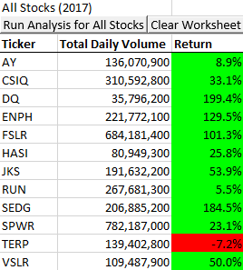

# Stock-Analysis
Module 2 for GW's data analysis class

## **Overview of Project** 
Steve, a recent graduate with a finance degree, wanted to help his parents invest in green energy stocks. Until this point, they had invested solely in one stock, DAQO New Energy Corporation. Steve sent us a handful of stocks that fit his parents' parameters, and asked us to analyze their performance in 2017 and 2018. 

## **Results**

### **Findings**
After recieving the data from Steve, I wrote a VBA module to analyze these stocks at the push of a button. Specifically, we were looking for the total volume of the stock traded, and the annual return. After completing this seperate analysis for both 2017 and 2018, it was clear that while most of the stocks had had a massive boost in the markets in 2017, the majority lost a good portion of that gain in 2018. This highlights the importance of diversifying Steve's parents' stock holdings, focusing on the companies that had continuous gains and more minor losses in 2018 as compared to their 2017 gains. Specifically, I would recommend not only RUN and ENPH for their continued growth, but also VSLR, FSLR, and SEDG for losing the smallest portion of their 2017 gains in 2018. 

### **Method**
After seeing the results of my 2017/2018 comparison, Steve asked if I could re-work my program so that he could use a much larger data set and compare more stocks. The VBA program I had written was already a bit slow handling the data set Steve had initially sent me, so it was clear that I needed to refactor it and make it more efficient. My initial VBA module used two For loops, the first of which would search the entire list for instances of a specific stock ticker, sum the values, and find the annual return. This was innefficient, due to the entire list being cycled through for each ticker.

My second approach used arrays to store the values as the program cycled through the list of trades only once, storing each sum of values and return as a new value in the array. This greatly increased the speed of the program, and made it much more useful for Steve to apply to his larger stock market data set. 

## **Summary**

The usefullness of a piece of code often lies in its efficiency. The run time of the initial VBA module did not make it practical to use on a scaled up data set, which limits its helpfulness to its users. While it can be frustrating or difficult to refactor and restructure code that already works, the payoff of it being clearer and having more applications makes up for any time lost. The greatly reduced run time of the second version of the module made it possible for it to be applied to much larger data sets, and meant that I did not need to create a new program to help Steve tackle his much larger data sample. It is rarely easier to start from scratch than it is to rework a proven solution. 
